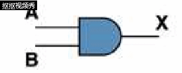
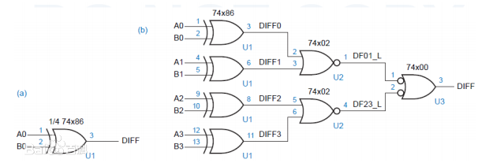
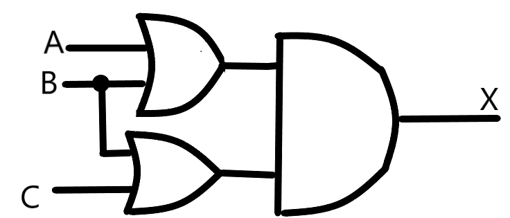
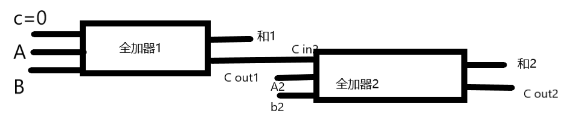

# part1 of homework
1)AND:  A*B

 
|A|X|
|-|-|
|0|1|
|1|0|

2)XOR:  A⊕B

|A|B|X|
|-|-|-|
|0|0|0|
|0|1|1|
|1|0|1|
|1|1|0|

3)如图

4)(A')⊕(A*B)

5)电路等效性：对应每个输出值组合，两个电路都生成完全相同的输出。

|A|B|(AB)'|(A'+B')|
|-|-|-----|-------|
|0|0|1|1|
|0|1|1|1|
|1|0|1|1|
|1|1|0|0|

# part2 of homework

6)

7)(1)X8X7X6X5X4X3X2X1

(2)X8X7X6X50000

(3)X8X7X6X50000

# part3 of homework

1).In electronics, a logic gate is an idealized or physical device implementing a Boolean function; that is, it performs a logical operation on one or more binary inputs and produces a single binary output. Depending on the context, the term may refer to an ideal logic gate, one that has for instance zero rise time and unlimited fan-out, or it may refer to a non-ideal physical device[1] (see Ideal and real op-amps for comparison). 

2).In mathematics and mathematical logic, Boolean algebra is the branch of algebra in which the values of the variables are the truth values true and false, usually denoted 1 and 0 respectively. Instead of elementary algebra where the values of the variables are numbers, and the prime operations are addition and multiplication, the main operations of Boolean algebra are the conjunction and denoted as ∧, the disjunction or denoted as ∨, and the negation not denoted as ¬. It is thus a formalism for describing logical relations in the same way that elementary algebra describes numeric relations. 

1)Flip-flop 触发器
2)1位