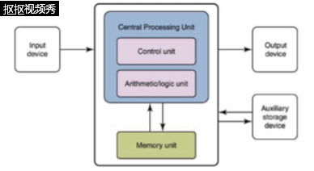

1.如图

2.8位

3.control unit and arithmetic/logic unit, uninclude cahce

4.硬盘、光碟、闪存卡、U盘或其他速度缓慢但拥有很高容量的设备。

5.cpu:&ensp;（英语：Central Processing Unit，缩写：CPU），是计算机的主要设备之一，功能主要是解释计算机指令以及处理计算机软件中的数据。计算机的可编程性主要是指对中央处理器的编程。1970年代以前，中央处理器由多个独立单元构成，后来发展出由集成电路制造的中央处理器，这些高度收缩的组件就是所谓的微处理器，其中分出的中央处理器最为复杂的电路可以做成单一微小功能强大的单元。

RAM:&ensp;随机存取存储器（英语：Random Access Memory，缩写：RAM），也叫主存，是与CPU直接交换数据的内部存储器。它可以随时读写（刷新时除外，见下文），而且速度很快，通常作为操作系统或其他正在运行中的程序的临时数据存储介质。 
主存（Main memory）即计算机内部最主要的存储器，用来加载各式各样的程序与数据以供CPU直接运行与运用。由于DRAM的性价比很高，且扩展性也不错，是现今一般计算机主存的最主要部分。2014年生产计算机所用的主存主要是DDR3 SDRAM，而2016年开始DDR4 SDRAM逐渐普及化，笔电厂商如华硕及宏碁开始在笔电以DDR4存储器取代DDR3L。 

ROM:&ensp;只读存储器（Read-Only Memory，ROM）是一种半导体存储器，其特性是一旦存储数据就无法再将之改变或删除，且内容不会因为电源关闭而消失。在电子或计算机系统中，通常用以存储不需经常变更的程序或数据，例如早期的家用计算机如Apple II的监督程序 [1]、BASIC语言解释器、与硬件点阵字体，个人计算机IBM PC/XT/AT的BIOS（基本输入输出系统）[2]与IBM PC/XT的BASIC解释器，与其他各种微计算机系统中的固件（Firmware），均存储在ROM内。 

BUS:&ensp;系统总线（英语：System Bus）是一个单独的计算机总线，是连接计算机系统的主要组件。这个技术的开发是用来降低成本和促进模块化。系统总线结合数据总线的功能来搭载信息，地址总线来决定将信息送往何处，控制总线来决定如何动作。虽然系统总线于1970年代至1980年代广受欢迎，但是现代的计算机却使用不同的分离总线来做更多特定需求用途。 

Parallel computing:&ensp;&ensp;并行计算（英语：parallel computing）一般是指许多指令得以同时进行的计算模式。在同时进行的前提下，可以将计算的过程分解成小部分，之后以并发方式来加以解决[1]。 
计算机软件可以被分成数个运算步骤来运行。为了解决某个特定问题，软件采用某个算法，以一连串指令运行来完成。传统上，这些指令都被送至单一的中央处理器，以循序方式运行完成。在这种处理方式下，单一时间中，只有单一指令被运行(processor level: 比较微处理器，CISC, 和RISC，即流水线Pipeline的概念，以及后来在Pipeline基础上以提高指令处理效率为目的的硬件及软件发展，比如branch-prediction, 比如forwarding，比如在每个运算单元前的指令堆栈，汇编程序员对programm code的顺序改写)。并行运算采用了多个运算单元，同时运行，以解决问题。 

6.&ensp;云计算（英语：cloud computing），是一种基于互联网的计算方式，通过这种方式，共享的软硬件资源和信息可以按需求提供给计算机各种终端和其他设备。 

### 第七题

(1).DDR3 SDRAM（Double-Data-Rate Three Synchronous Dynamic Random Access Memory），是一种电脑存储器规格。它属于SDRAM家族的存储器产品，提供相较于DDR2 SDRAM更高的运行性能与更低的电压，是DDR2 SDRAM（四倍数据率同步动态随机存取存储器）的后继者（增加至八倍）。

DDR3：是指第三代内存技术

1333:支持1333MHz

(2)会

(3)没有

(4)64