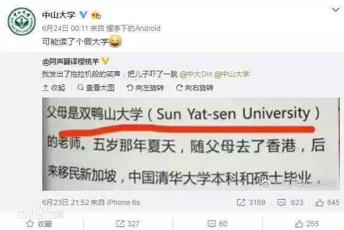
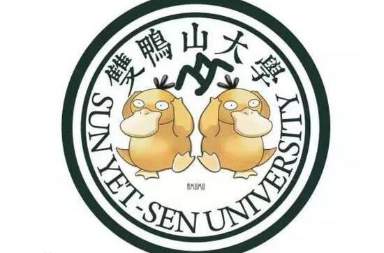

# 双鸭山大学的来源

1 走红经过:
微博上一本书的截图出现了这样一段话：“1984年出生在中国广东省广州市，父母是双鸭山大学（Sun Yat-sen University）的老师。五岁那年夏天，随父母去了香港，后来全家移民新加坡。中国清华大学本科和硕士毕业，新加坡南洋理工大学博士毕业，现在香港中文大学任助理教授。

2 走红原因:
始作俑者“云湖浪子YZ25T”就此回应称，“双鸭山大学”并非错译，而是在自己小圈子里已流传长达五年的一个梗。五年前他在广州坐地铁，路过“中大”站，方知道中山大学的英文名就是“Sun Yat-sen University”，但听报站音像“双鸭山大学”，他还曾在校内网（现人人网）上发照片说：“原来中山大学的英文是双鸭山大学。” 

3 相关信息:
“Sun Yat-sen”，其实是孙中山的英译名。对孙中山的英译名为何是“Sun Yat-sen”，较为常见的一说是孙中山别名孙逸仙的音译，还有更细致的考证说是孙逸仙的粤语音译