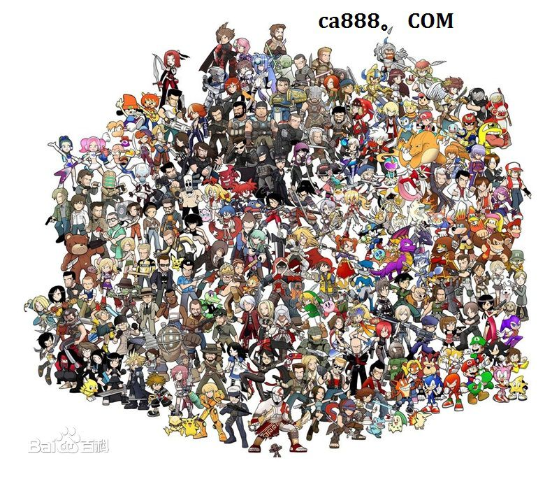

电子游戏

电子游戏（Electronic Games）又称视频游戏（Video Games）或者电玩游戏（简称电玩），是指所有依托于电子设备平台而运行的交互游戏。根据媒介的不同多分为五种：主机游戏（或称家用机游戏、电视游戏）、掌机游戏、电脑游戏、街机游戏和移动游戏（主要是手机游戏）。完善的电子游戏在20世纪末出现，改变了人类进行游戏的行为方式和对游戏一词的定义，属于一种随科技发展而诞生的文化活动。电子游戏也可代指“电子游戏软件”。

中文名
电子游戏 

外文名
Electronic games 

注    音
diàn zǐ yóu xì 

性    质
利用电子设备为媒介进行游戏活动 

出    现
20世纪60年代末 

特    征
互动性、模拟性 

优点

促孩童养成良好习惯，助老人大脑灵活运转

虽然电子游戏因其潜在有害的影响而屡遭诟病，但是研究人员设法通过电子游戏的种种特点来使其帮助人更好的生活。
电子游戏十分有魅力，这个特点不仅可以让人沉迷，适当的转换可以变成“生动的教科书”。通过电子游戏的魅力，可以让儿童多吃蔬菜、帮助老年人保持大脑的灵活运转，甚至借助电子游戏来解决像贫困和气候变化之类的社会问题。
哈里斯进行的一项网上调查显示，大多数美国人认为电子游戏与暴力行为之间有联系。但是在研究上表现，无法证明暴力行为和电子游戏间有联系。即便大多数人“宁可信其有，不愿信其无”。研究人员迫切希望通过实验证明电子游戏能带来的益处。
北卡罗来纳州立大学游戏获益实验室的贾森·阿莱尔说：“游戏可以产生积极影响，特别是在心理上。”他表示：“我们集中研究了游戏对认知和学习的影响，想了解其确切的作用过程，譬如说对反应时间和记忆力的影响。”
在阿莱尔领导下进行的一项研究发现，玩电子游戏的老年人在情绪上表现得健康。
阿莱尔同时说，电子游戏屡遭诟病是因为玩家经常沉溺于电子游戏，但指责电子游戏造成社会问题无疑是把问题搞得过于简单化了。
但他也表示，经过一系列枪击案后，研究人员正在反思他们的观点。阿莱尔说：“作为一名科学家，我认为游戏能产生积极作用，但也不能说它们不会产生消极影响。”尽管如此，他也表示说：“也没有证据表明玩暴力电子游戏会导致游戏玩家涉足暴力行为。”
报道称，大型游戏公司和独立游戏开发商制作了许多旨在培养积极健康的生活技能和习惯的游戏。由美国西北大学学生丹尼斯·艾创办的一个游戏开发小组制作了一款鼓励孩子多吃水果蔬菜的电子游戏，目的是控制儿童肥胖。就连常常遭到批评的射击游戏也可以产生积极影响：多伦多大学的一项研究表明，玩射击或赛车游戏能提高玩家寻找隐藏目标的能力。
多伦多大学研究人员伊恩·斯彭斯说，这些视觉技巧非常实用。“对行李扫描、看X光或核磁共振成像图、分析卫星图像、识破伪装甚至在人群中找到朋友的脸来说，这都是非常必要的。”
波士顿儿童医院的研究人员在报告中说，一个游戏能帮助易怒儿童控制自己的情绪 [2]  。在这个游戏中，玩家在向敌军飞船开火的同时还要避免误伤友军。当心率上升到超过某个水平的时候，玩家就失去了射击能力。这款游戏能教给他们保持冷静的技巧。
美国东北大学教授马吉·赛义夫·纳斯尔一直在研究游戏对玩家的影响。他说，一些人玩游戏是为了寻找一种满足感，另一些人玩游戏是为了和朋友联系。纳斯尔说：“一些游戏可以促进思考。这种解决问题的活动能逐渐促进认知，提高记忆力。” [3]  

电子游戏有助于提高动态视力

多数人都认为，孩子玩太多电子游戏会对视力造成影响。但美国最新一项研究表明，像《反恐精英》和《使命召唤》《战地》 这样的射击类游戏，却有助于提高人的视力，尤其是动态能力。
在日常生活中，人眼需要分辨边界清晰的物体，也需要分辨边界模糊的物体，后一种分辨能力称为对比敏感度。对比敏感度是衡量视力的一种常用测试标准，主要考察人眼发现细微灰度变化的能力，对于夜间驾驶、阅读等活动非常关键，正常情况下会随着年龄增大而逐渐减退。通常情况下，对比敏感度无法通过训练来提升，必须通过佩戴眼镜或接受激光手术的方式来矫正。
但纽约罗彻斯特大学大脑感知学教授达芙妮·巴威莱尔发现，经常对着电脑屏幕上的虚拟目标瞄准和射击，可以大大提高人们的对比敏感度。为了验证这个结论，达芙妮和他的同事们进行了两项试验。
首先，他们找到两组游戏迷，分别对他们进行对比敏感度的测试。其中一组游戏迷是射击类游戏爱好者，他们是《虚幻竞技场》和《使命召唤》的忠心玩家；另一组虽然也热衷游戏，但并不爱玩快节奏的射击游戏。测试结果表明，射击类玩家在对比敏感度测试中的成绩比非射击类玩家高58%。随后，科学家们又对这组不爱射击类游戏的玩家进行训练，50多个小时后，这些非射击类游戏玩家的对比敏感度竟然平均提高了43%。
达芙妮说，玩家在射击类游戏中闪转腾挪，寻找目标并瞄准射击的过程，可以改善人眼获得的视觉信息。更重要的是，研究证实这种改善视力的效果并非短期性的。达芙妮称：“通过射击类游戏训练，对比敏感度的提升可以持续几个月，甚至几年。”
达芙妮认为，可以通过电子游戏来训练司机的夜间驾车能力或战斗机飞行员的能力。 [4]  
电子游戏可提高视觉搜索能力
多伦多大学的最新研究表明玩射击和驾驶类游戏似乎有助于提高你在复杂场景中寻找特定目标的能力，即使只玩了一小段时间。这项研究是由心理学教授伊安·斯潘斯和吴似锦博士共同推出的，他们用三项视觉搜索测试比较了玩家和非玩家，发现有经验的老玩家技高一筹。
在第二项实验中，研究者们选取了60名没玩过游戏的参与者，并令他们玩了共计10小时的游戏。20名参与者被随机指定玩《荣誉勋章》，20人玩《极品飞车》，另60人则被指定玩解谜游戏《平衡》作为对照组。
“近期的不同研究，包括我们这项在多伦多大学的研究，都表明玩第一人称射击类游戏能提高视觉上的注意力，”伊安教授说，“但之前从没有迹象表明视觉搜索能力也能提高。”
“我们已经说明玩赛车竞速类游戏能与射击类带来同样的好处，”吴补充道，“这在我们想要训练这方面技能时将十分重要。竞速类游戏比射击类更容易被接受，因为他们没有那么暴力。” [5]  
艺术研究
先进的科学家和社会研究者认为电子游戏是一门艺术。这几个特性让电子游戏在当今文化中脱颖而出，成为一门艺术。
综合性：在电子游戏中，可以出现以往出现的任何一门艺术，例如游戏中的电影、游戏中的音乐、游戏中的雕塑模型、游戏中的影视。游戏以综合性包容一切艺术，并为自己服务。
交互性：以往艺术中没有出现过的特性。玩家第一次会受到艺术的反馈。玩家在欣赏美术、或者观看影视时，只是单纯的接受。而电子游戏能让玩家与电子游戏构造的虚拟世界互动，从而更容易让人投入。
广泛性：游戏是人类的本能，但是游戏也有它的局限性。将游戏搬上电子平台，简化了进行游戏的难度，还增加了游戏的变数。

争议

沉溺电子游戏

许多家长认为，电子游戏让孩子沉迷其中，不思学习。甚至因为要买游戏，从而偷窃、抢劫，引发各种社会问题，所以电子游戏“该禁”。
在这方面电子游戏研究学者贾森·阿莱尔说：“电子游戏屡遭诟病是因为玩家经常沉溺于电子游戏，但指责电子游戏造成社会问题无疑是把问题搞得过于简单化了。” [3]  
电子游戏十分有魅力，吸引人去不断的游玩，但这是所有游戏的特征，因为游戏是人的天性。一般人也可以沉迷于下棋、打牌等娱乐活动中，但是却没有人去说下棋、打牌是错误的。同样，电子游戏只是一种娱乐手段，是否沉迷取决于玩家的自制力。
电子游戏不是电影中的外星妖魔，没办法控制人类的思想。人不可能见到某样事物就不自主的沉迷进去，沉迷的原因不在于这件事物，而在于“人心”。如果说人见到电子游戏就必定会沉迷进去的话，为什么世界上还有这么多人不玩电子游戏呢？
所以说，沉溺于电子游戏的原因归结于电子游戏这个东西存在，并武断的把解决办法定位为“拒绝电子游戏”这种行为，就像是把食物中毒的原因归结于地球上有食物存在，解决办法是不要再吃食物一样可笑。
至于盗窃、抢劫案件，将这些与电子游戏联系在一起就更没有依据了。首先，因为电子游戏而作案的民事案件占每年发生的民事案件的几率可以低到忽略不计；其次，品德败坏的人，和其玩不玩电子游戏无关——品德良好的人，玩的游戏再多，也不会去偷窃、抢劫；品德败坏的人，即便不玩电子游戏，也会烧杀抢掠。将电子游戏和社会问题联系在一起，是不经调查、不负责任的。 [6]  

助长青少年叛逆

对于电子游戏助长青少年叛逆行为的话题，国内已很多声音。还有人付诸行动戒掉“网络游戏瘾”，国内甚至出现了“杨永信”教授的“电击疗法”，通过残忍的电椅电击青少年的方法，设法让其“听话”，“戒掉网络游戏瘾”。
事实上，比起说这些青少年叛逆的基因来自于游戏，不如说来自于失败的家长教育 [7]  。能够如此狠心抽打、辱骂自己的孩子的父母，只会让孩子更加的对现实生活失望，从而沉迷于游戏、逃避现实。这些青少年，通过游戏中的打怪升级来获得快乐，他们的原因就是因为在现实里得到不了快乐，得到的只有来自父母的打击。
当青少年沉迷游戏时，父母应该去引导，而不是责骂，甚至狠心的让自己的儿童去被毫无伦理道德的电击。不要将儿童在青春期的正常叛逆行为归罪于游戏，因为没有证据标明它们间有联系。而父母不良的处事方式和做人原则，影响青少年成长的例子却比比皆是 [8]  。一些别有用心的人，利用否定电子游戏来转移人们对于家庭暴力等家庭问题的视线，是极其不负责任的表现。毕竟电子游戏是外因，真正决定孩子性格则是他的家庭 [7]  。
至于杨永信电击疗法，更能给我们其他的沉思。科学的判断何为“上瘾”，不要没有到达“上瘾”就用电击，没有上瘾就电击不是治疗是折磨。这还不是根本，“电击疗法”是否违背伦理道德。连吸毒都不会使用电击疗法的今天，区区电子游戏上瘾竟然要使用电击。用痛苦的条件反射来戒除网瘾，是多么残酷，而这种行为竟然还受到了某些家长的支持，更是令人值得对现代中国的教育方式反思。 [9-10]  

暴力

电子游戏的一个极具争议的问题就在于，部分电子游戏中包含暴力。
在国外，解决办法一般是使用游戏评级系统。中国在这方面发展几乎为零。有些成年人，可以依靠带有暴力元素的电子游戏来满足自己的欲望，反而对社会的危害减小。而研究显示，电子游戏本身也可以降低人的暴力行为 [2]  。
实际上，电子游戏中的暴力和动作电影中的打斗镜头是一样的。但是电影中出现暴力镜头明显更容易被人接受。这是由于大多数人对电子游戏的一种排斥。

不要“谈游戏色变”

大多数家长不了解，本质的排斥电子游戏，再加上很多专家宣传“网瘾和游戏有必然联系”产生一种对家长和孩子的暗示。家长开始认为孩子在正常青春期的所有反抗都来自于电子游戏，而青少年在这时即便正常接触电子游戏也会被家长们压制，孩子喜爱的事务遭到了家长的否定，这只会造成孩子更大的叛逆，甚至面对父母还会逃避、自暴自弃。
解决问题的关键在于，不要对电子游戏有偏见。
当务之急是讨论出电子游戏的定义，这首先有很多问题点：
1、“电子游戏”这个词语的意义，因为下棋、踢球都是游戏的一种，为何只有电子游戏倍受排挤。
2、电子游戏和网瘾、叛逆的是否有必然联系，是否助长暴力和社会问题。
3、明知道“封禁”对电子游戏无效，应寻求其他的解决办法，引导并发展电子游戏。
4、中国需要正视拒绝发展游戏评级系统的错误 [11]  。这体现出中国在网络游戏和其他电子游戏之间发展、监管的失衡。大多数玩家沉迷于网络游戏并引发问题，但不是所有的电子游戏都是网络游戏。
只有没有偏见，将玩电子游戏视为“理所应当”的事，才能有效的监控、发展电子游戏的和其相关产业。也只有这样，中国的游戏业发展才不会更加畸形，并朝着健康、负责任的局面前进。

历史沿革

游戏的诞生

电子游戏于1952年面世，为井字棋游戏，游戏平台是真空管电脑，当时现代电脑也只是刚面世不足十年。之后出现的是发布于1958年10月18日的网球游戏《双人网球》（Tennis For Two），虽然说是网球游戏，实际上的画面却比较类似现代的气垫台。 [12]  

雅达利时代

基本上大家公认的第一个游戏市场是ATARI时期 [12]  ，它的模式是，ATARI出主机，同时也给自己主机出游戏，主机和游戏都赚钱。 [12]  而其他厂商也可以给ATARI出游戏。 [12]  但是这个市场其实非常不稳定，情况与手游市场可以说一模一样：当时的玩家素质低， [12]  对于什么游戏好什么游戏差并不清楚，买游戏时撞大运的成分大，这就给大量浑水摸鱼厂商以机会。 [12]  垃圾游戏充斥市场，ATARI自己也在刷新游戏质量下限，并制造了《ET》。 [12]  
1970年代，文字式游戏出现，也是Atari的黄金期。1976年Atari易手，全力发展电子游戏事业；日本方面，另一大厂Taito也加入游戏界战团，推出了经典游戏《太空侵略者》。1980年代初，各款经典游戏相继发行，首先Namco推出《吃豆人》，期后Zork推出《创世纪》，任天堂亦推出《大金刚》；其他电器大厂如飞利浦和IBM也加入电子游戏业，美国EA电子艺界亦在这时组成。1980年代中期，Atari、世嘉及任天堂将战场转移到家用游戏机硬件上，同时推出新款家用机。

转折和发展

1980未期是电子游戏的转折点。电脑由于得到显卡的强大支持，开始渐渐掘起；另一大突破是，任天堂推出Game Boy，打开了便携式游戏机的无限发展空间。
踏入90年代，家用机已占游戏市场8成，任天堂发行超级任天堂，世嘉亦宣言将会在不久将来推出次世代家用机，吸引了大众的焦点，家用机大战一触即发;街机方面，capcom推出街头霸王，为街机争回喘息的机会；Pentium芯片面世，亚洲中文地区亦开始自行开发针对IBM PC兼容机的电脑游戏，《仙剑奇侠传》、《炎龙骑士团》、《神奇传说》等经典游戏相继推出。1990年代中，次世代游戏机横空面世，世嘉和索尼分别发表Sega Saturn及PlayStation，任天堂即时被打沉，惟有在两年后推出N64反击。
21世纪前，家用游戏形成三足并立的局面，N64原本在机能上远胜另外两款家用机，不过其插卡带游戏模式，使N64流失大量玩家游戏开发商，为求改变局面，世嘉最先推出新款家用机——Dreamcast；正当各款家用机正争持不下的时候，微软的视窗系统几乎已经垄断家用电脑市场，模拟人生、无尽的任务、暗黑破坏神分别在电脑平台上登场。

二十一世纪的进步

踏入二千年，索尼率先向世嘉还击，推出PlayStation 2(PS2)，01年，任天堂亦跟随推出新机种GameCube，同年，电脑软件龙头微软进军电子游戏业，发行了首部家用机Xbox，电子游戏混战由三国变成四国，不过，二千年早期的家机大战，由索尼高姿态胜出，至今已经卖出超过一亿台主机，论机能，其实都不分轩轾，不过索尼背靠强劲的多个游戏开发商，全球热爆的大作最终幻想(Final Fantasy)、勇者斗恶龙(Dragon Quest)、生化危机(Bio Hazard)都选择着陆在索尼的主机PS2上，令PS2在第二次家用机大战中获胜；与此同时，电脑游戏再次分家，分为单机游戏和网络游戏；单机版游戏方面，自02年开始，Maxis发行的模拟人生已经连续称霸了电脑游戏榜多年；网络游戏则被称为发展的项目，尤其是在中国大陆，原因是拥有电脑及能连上互联网的人，远比拥有任何一款家用机的人多；在二千年，西方国家已经发展了数年的网络游戏，EQ及UO已经在西方国家生根，在亚洲国家则刚起步，台湾游戏金庸群侠传及韩国游戏仙境传说均引起热潮。
二千年中期，网络游戏由于其一直为人诟病的外挂问题，使其发展停济不前，惟独暴雪的魔兽世界能一枝独秀；被人遗忘了的便携式游戏机起了另一场风云，雄霸了便携式游戏机市场近十五年的任天堂，接受索尼新机PlayStation Portable的正面冲击，任天堂推出新主机Ninetndo Dual Screen(NDS)迎战，但两者方向迥异。
2006年，家用机市场再起风云。世嘉完全退出了家用机硬件的战场，回归到游戏开发上；在第三次家用机大战中，微软首先出招，推出Xbox 360，以强劲的电脑底板作支持，在电子运算上远超当时其他主机，索尼推出PlayStation 3，索尼在PS3上创新地使用了蓝光光盘，但由于游戏开发成本高昂，令不少大厂家退出索尼的幕后，任天堂则推出Wii，Wii在机能上远逊于两机，不过具有动态感应的新型主机操作方式，以真实互动为卖点，成为最为畅销的主机，且避开了于微软、索尼的直接竞争。
直至2009年中，三款家用机各有长短，Wii销售领先，Xbox 360屡发质量问题，但是其线上游戏；电脑游戏方面，依然是模拟人生和魔兽世界两只游戏，分别在单机游戏和网络游戏领先，不过网络游戏的涌现，令大量粗制滥造的产品充斥市面，同时线上游戏分支网页游戏以及逆行传统商业游戏模式的独立游戏崛起；苹果的iphone则扩展了手机游戏市场。

产业格局

根据《2015年CESA游戏白书》等官方资料获悉，包括任天堂自身在内11家大型发行商占据了全球79%的游戏软件市场份额， [13]  中小企业的生存空间日益狭窄。 [13]  
早在2005年，岩田聪在受邀进行TGS游戏展产业基调讲演中指出：“当前游戏产业的寡占化趋势越来越严重， [13]  极少数的大企业占据了绝大多数的市场份额，这样的状况对于产业的发展是非常不利的 [13]  ，任天堂未来想努力的方向就打破这样的局面，竭尽全力去扩大市场……” [13]  
公心角度，作为一个小型游戏开发会社CEO出身的岩田聪深知寡占化对游戏业发展的危害， [13]  希望能改变这种局面。私心角度是岩田清醒的看到业内原有那些巨头已经习惯了索尼阵营朝小野大的竞争格局，迫切希望能够能培育出全新的力量以扭转变动局面。 [13]  就像当年FC时代山内溥将SQUARE、ENIX等原本境遇不佳的小型会社一步步提携到和NAMCO、KONAMI等巨头平起平坐，以加强市场掌控力的策略一样。 [13]  诸如EA、SQUARE-ENIX和动视等既得利益者， [13]  对于任天堂试图“改天换地”的雄心壮志非常不以为然，碍于当时任社逐步上升的发展势头，只能虚与委蛇以应付之。 [13]  

平台

电子游戏包括：主机游戏、街机游戏和便携游戏。因为电子游戏通常代指“电子游戏软件”而非媒介设备，所以有必要对运行软件的平台进行分类。
在电子游戏的形成和发展过程中，游戏软件的分类始终伴随着它。许多电子游戏都是从传统游戏中继承来的，其中图版游戏对电子游戏的发展产生了很大的作用。 [14]  

家用主机

主条目：游戏主机、主机游戏

“主机”（Console）是最常见和广泛的游戏平台，运行在主机上的电子游戏称作“主机游戏”（Console Game）。雅达利的雅达利2600是公认的第一个最成功的商业化的专为游戏所设计的平台。它确定了：一个主机，分离的控制器，可更换游戏内容的存储器（卡带）。此后的任天堂的FC皆是此架构的延续。
初期的雅达利2600画面相当简陋，主机内存也不过4k，而此类平台发展沿革至今，运算效能已经远远超过当初，向着更真实化的画面发展。而且在最新的XBOX360与PS3上其已经不再是单纯的游戏主机，而是希望成为每一个家庭的客厅的多媒体娱乐中心，包括游戏、视频、图片、音乐、网络等等。但另一方面，新型电脑也作为一种运行媒介，试图与游戏主机争夺未来家庭多媒体娱乐中心的位置。
需要注意的是，虽然“掌上游戏机”（Handheld Game Console）也是“游戏主机”（Game Console）的一种，但是通俗用语中的“游戏主机”都是指体积较大、放置于家中或专门游戏店内的家用主机。掌上游戏机则因为便携特点单独被列为“便携游戏机”的一种。

掌上主机

主条目：掌上游戏机、便携游戏

“掌上主机”（Handheld），也叫掌上游戏机，简称掌机。是1980年代后期以后，个人使用的行动化（Mobilization）所产生的新型机种。在当时使用移动电子设备成为潮流，例如手机。从而新形成的一种消费模式，当然各游戏厂商也开发了可以携带的游戏主机。最初的掌上主机叫做GAME&WATCH，他的软件是完全烧死在机板上的ROM，无法替换游戏。而第一个可以替换游戏的掌机是在1979年，但第一个最成功的商业化掌上主机仍然是由任天堂开发的初代Game Boy。
要注意的是，智能手机也具备运行很多较大型3D游戏的能力，手机也可以作为一种掌上主机存在，不过为了方便分类，掌上主机和手机的游戏会通称“便携游戏”（Handheld Game）。

街机

主条目：街机、街机游戏

街机（Arcade）即是流行于街头的商用游戏机，以此名称别于个人电脑和家用游戏机。在街机上运行的游戏软件称为“街机游戏”（Arcade Game）。
街机在中国十分受争议，因为赌博街机的出现让整个游戏业都蒙上了阴影。事实上，赌博游戏机和街机、电子游戏都没有直接的关系，一些专家教授，利用赌博问题来指责电子游戏，是片面的。

电脑

主条目：电脑游戏

电脑游戏，即是利用计算机运算的游戏，也是电子游戏中唯一不依靠“游戏机”这种设备运行的游戏。虽然在欧美等地，游戏主机更为发达。但在亚洲东部，韩国、中国、台湾地区，仍是电脑游戏占据主动。电脑游戏以其配置的灵活性成为运算能力大的游戏媒介，但是电脑游戏业最头疼的是电脑游戏配置不一所造成的兼容问题。
藉由电脑本身具有的互联网连接功能，电脑可不依靠游戏机网络连接多人游戏网络。所以网络游戏在电脑上最为发达。

游戏分类

主词条：游戏类型
　　
 
图为Wii U 
狭义的电子游戏是一种软件，因此必须有相应的硬件设备（即游戏机），两者是一种模组化（Modulized）的关系。例如魂斗罗（Contra）一代所对应的游戏平台就是红白机（FC）。
一般而言，游戏的平台各有不同市场，因此不宜以相同的标准来比较，即使它们之间的游戏常常相互移植。
电子游戏软件会分为完全不同的形式，类型各有交集。例如美国倾向把射击、格斗游戏合并到动作游戏中；台湾地区倾向于把策略、战略游戏合并到模拟游戏里（意为模拟战场）；日本地区有家庭游戏这个独特的分类。而中国大陆分类游戏的方式非常混乱。 [15]  
主流分类（欧美）：动作、冒险、角色扮演、策略、模拟、休闲、体育。