# 一、加法
实验过程如下图

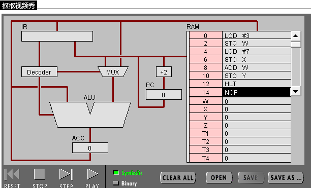
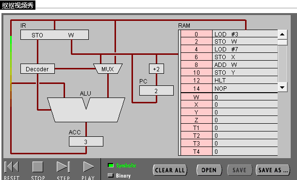
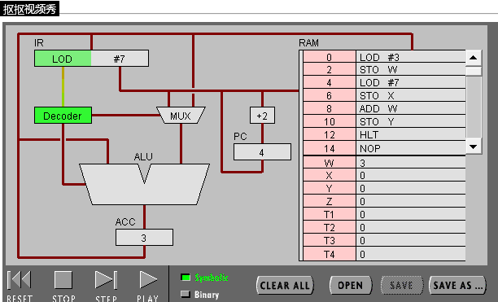
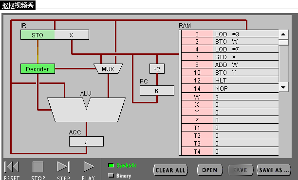
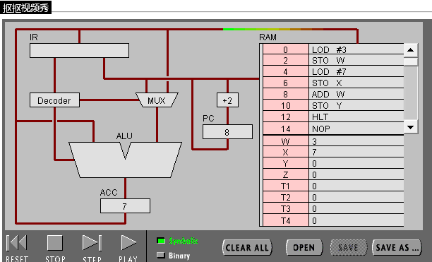
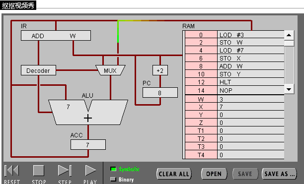
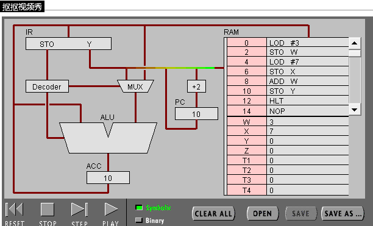
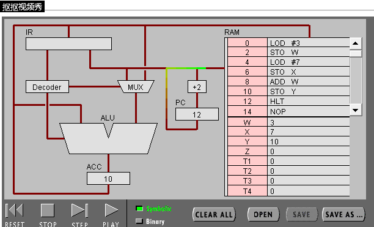

## （1）

1.PC，寄存接下来要执行的指令。IR，寄存正在进行的指令。

2.全名是accum,是用来寄存数据的。

3.

1).取得LOD #3指令.

2).解码为LOD和3。

3).执行

4).将3储存在ACC中

4.

1).取得ADD #3指令。

2).解码为ADD和W。

3).执行：取得W的值，与暂存器中的7相加得10.

4).储存10在acc中。

5.LOD #3是直接取值3.而ADD W是先取得W中储存的3，才能用。

## （2）

1.

|00010100|00000111|
|-|-|
|LOD|7|

2.RAM的地址是指令的地址。

3.8位。

4.

    #include<stdio.h>

    int main(){
        int w,x,y;

        w=3;
        x=7;
        y=x+w;

    }

# 二、循环

实验过程如图所示

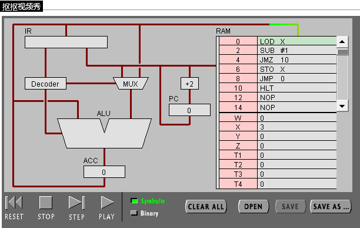
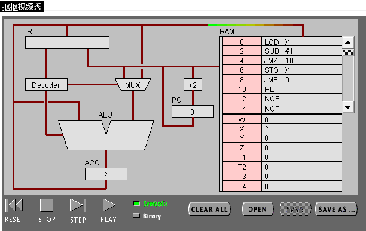
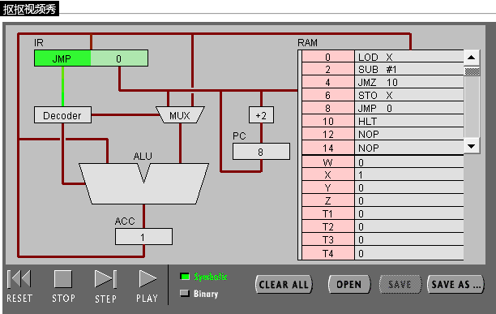

## (1)

1.使x的值不停减1，直到x=1.

2.

    #include<stdio.h>

    int main(){
        int x=3;
        int i;
        for(i=3;i>1;i--)
            x--;
    }
## （2）

1.

 #include<stdio.h>

    int main(){
        int x，y;
        y=0；
        for(x=3;x>1;x--)
            y=x+y;
    }

2.

|0|LOD X|
|-|-|
|2|ADD Y|
|4|STO Y|
|6|LOD X|
|8|SUB #1|
|10|STO X|
|12|JMZ 16|
|14|JMP 0|
|16|HLT|