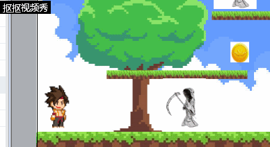
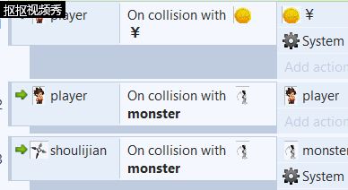
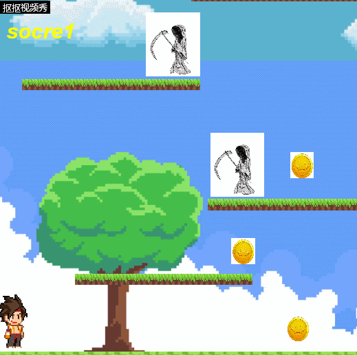

# 用construct2制作平台游戏

## 策划

主人公以吃金币和打怪得分，怪物碰到玩家，玩家死亡

## 设计

|player| |
|-|-|
|￥|碰撞&销毁￥|
|system|add1 to score|
|monster|销毁player|

|shoulijian| |
|-|-|
|monster|销毁monster|
|system|add1 to score|

|mouse||
|-|-|
|player|生成shoulijian|

|system||
|-|-|
|txet2|输出得分|

# 成品展示

