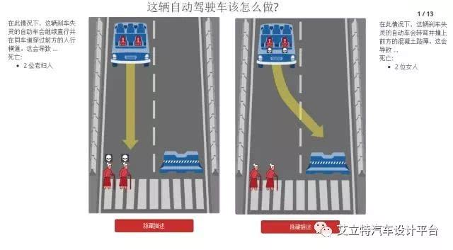
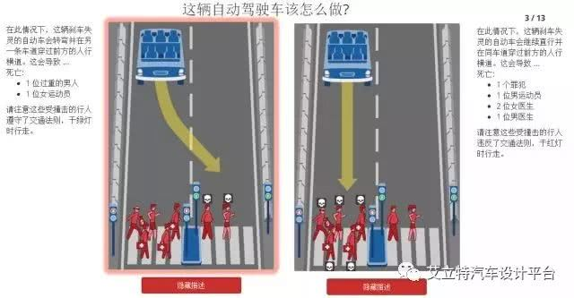
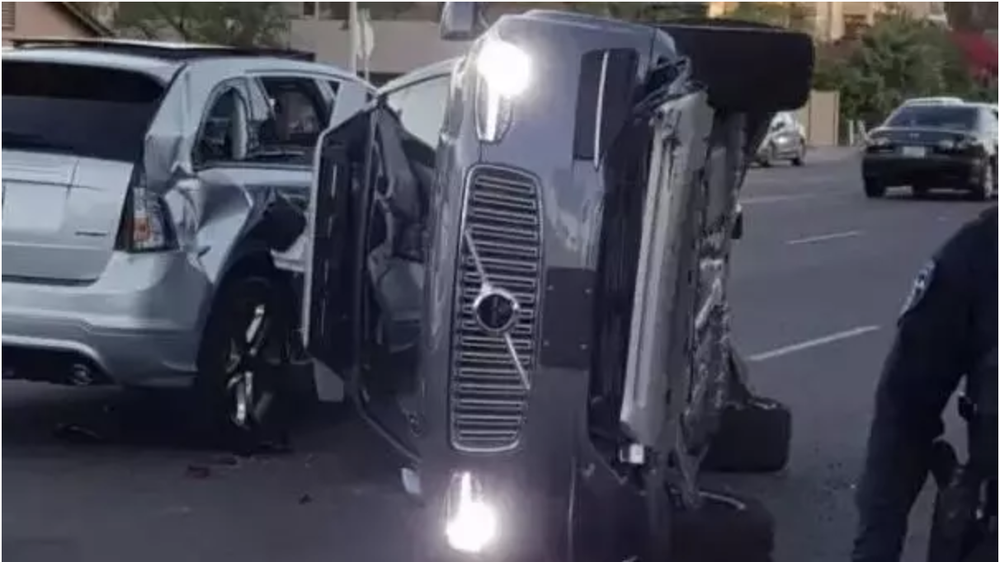
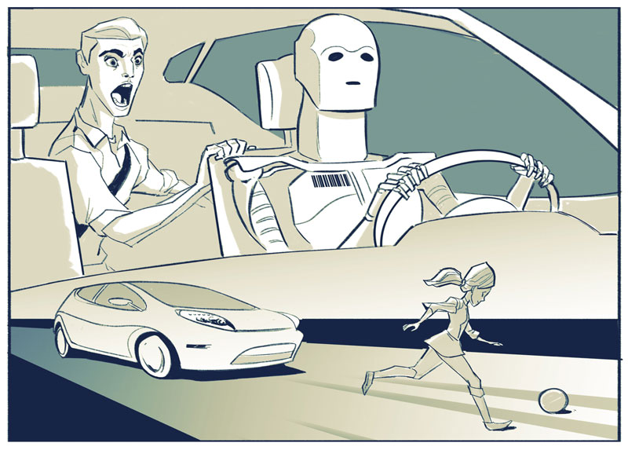

# 自动驾驶引发的伦理问题

# 持消极态度：

## 绕不过的“电车难题”

电车难题最早是由哲学家Philippa Foot提出的，用来批判伦理哲学中的主要理论，特别是功利主义，它的内容是这样的：

五个无辜的人被绑在电车轨道上。一辆失控的电车朝他们驶来，并且片刻后就要碾压到他们。幸运的是，你可以拉一个拉杆，让电车开到另一条轨道上。但是在那另一条轨道上也绑了一个人。你有两个选择：1. 不拉杆，五人死于你手下。2. 拉杆，一人死亡。你会怎么做呢？

此处，如果将电车化为一辆自动驾驶汽车呢？由于大部分道德决策都是根据“为最多的人提供最大的利益”的原则作出的，那这辆自动驾驶汽车毫无疑问会选择放弃一个人而拯救五个人。但如果这单独的一个人是我们的至亲、挚友呢？

如果未来的有人驾驶完全被无人驾驶取代，那我们就必须接受这种刻板的社会道德准则。让你眼睁睁地看着与你有直接关系的人的生死掌握在自动驾驶汽车的手中，你愿意接受吗？

————转自www.nbd.com.cn刘旭、李娜  《我们聊聊自动驾驶背后的伦理道德和法律问题 》   

## 避不开的“合法化”问题

现在关于自动驾驶汽车的争议，除了伦理道德，就是在自动驾驶的推进过程中，法律是其面临的最大阻力。这些自动驾驶汽车一旦发生交通事故，谁才是责任承担者？我们先看看各国如何应对。

美国：

现在只有内华达州、加州和佛罗里达州相继通过了法律条规，允许自动驾驶车辆上路测试。不过，该法规有附加条款，比如车内必须有人持有驾照，懂得操控汽车，在紧急情况下必须接过汽车的控制权。

欧盟：

目前，总部位于布鲁塞尔的欧盟总部也在就如何修改现行有关驾驶的法律法规（ECE R79）从而支持自动驾驶的健康快速发展，展开讨论和研究工作。

日本：

日本也提出要在2020年之前实现自动驾驶汽车方面的立法，并将自动驾驶作为今年9月七国集团交通部长会议的议题，预计会在今年内汇总出法规草案。

————转自www.nbd.com.cn刘旭、李娜  《我们聊聊自动驾驶背后的伦理道德和法律问题 》

# 持积极态度

## 1火车扳道岔问题

一列火车要经过一条岔路，但两条岔路都有人，你旁边有一个扳道岔可以控制火车走哪条道，让你选择杀一个人还是五个人，这个问题被认为是最经典的伦理问题。这显然是谋杀啊，你为什么要参与一场谋杀行动？你只要选择了，杀谁都是错的，救谁也是错的。

现实世界中这种情况是不存在的，大部分铁道都是封闭的，不封闭的铁道也严禁人进去玩耍，如果上铁道被火车撞死那是自杀。

如果有火车要经过铁路部门肯定知道，如果此时正好有维修工人在抢修铁道，那铁路部门应该提前疏散工人，如果没有及时疏散，显然是铁路部门失职。

这个毫无现实意义的坏逼问题有太多类似版本，比如你妈和老婆同时掉水里先救谁，不值得浪费时间去讨论。

————转自腾讯云企鹅号 - 艾立特汽车设计平台《自动驾驶所谓的“伦理问题”，其实都是技术问题》

## 2火车扳道岔问题的失控汽车版

这个问题的前提条件就是，刹车失灵，然后选择撞死行人还是撞死自己。

首先，我认为前提条件是不成立的，就算刹车失灵了，如果是燃油车应该提前降档用发动机制动减速，如果是电动车那就不存在这个问题，只靠动能回收就能将车辆刹停，开过电动车（非占号神器那种垃圾）的人都知道，动能回收开到高档时相当于中等程度的刹车，在低速下减速效果非常明显。别跟我抬杠说刹车和动能回收或定速巡航同时坏了，刹车失灵本就是小概率事件，燃油车诞生百年来刹车和定速巡航同时双重失效的只有两起案例，都是胡扯的。无人驾驶离普及还早，可以肯定会在电动车上面普及，至少会是电驱动/混动，因为禁售纯燃油车世界各国都提上日程了。

然后，无人驾驶车辆绝对严格遵纪守法，绝不超速，该减速时就减速。在有人行道的非完全封闭路段行驶时，车速一定不高，一般不超过 60km/h，而且经过人行道时一定会提前减速，一般是限速 30km/h通过斑马线，这种速度撞死人的几率已经很低了。再加上传感器探测到有人过马路，即便刹车失灵，也会依靠动能回收进一步减速，并鸣笛闪灯示意行人躲让。

这个问题的前提条件也是刹车失灵，坏逼之处就是无人车识别出了行人里面有罪犯，但一边多一边少，给你一些心理暗示让你纠结该杀哪些人。

事实情况是，无人驾驶的摄像头不会人脸识别，顶多能识别出高矮胖瘦，罪犯肯定无法识别，女人可能都无法识别，别被坏逼牵着鼻子走纠结是杀女人还是杀罪犯，即便人家有罪，也轮不到你来杀。

这图无人车是空的，那就简单了，即便动能回收也没刹停，为什么不选择摩擦护栏减速，或撞护栏呢？30km/h的速度有什么风险吗？毕竟是你的车出问题在先，你得想办法停下来啊，办法有得是。
那么这还是个伦理问题吗？

————转自腾讯云企鹅号 - 艾立特汽车设计平台《自动驾驶所谓的“伦理问题”，其实都是技术问题》

## 总结：自动驾驶不存在伦理问题，只有技术问题和法律责任问题

大部分所谓的伦理问题的前提条件是刹车失灵，那么责任很明显在于汽车厂商，既然刹车那么容易失灵，那就从技术上想办法让它没法失灵、及时检测失灵、提供冗余减速手段、提前减速并退出道路等待检修或救援。这不就完了嘛，还纠结个屁啊。不从源头上解决问题，总想着杀什么样的人，搞人种歧视的心理暗示，还自以为高人一等。

L4 以上级的无人驾驶汽车本来就拥有两套控制系统，必然会有实时检测机制，电动机就是备用刹车方案，有冗余设计故障率会更低。所以这些都不是伦理问题，而是技术问题，技术问题就不是问题。

所谓的伦理问题的定势思维就是违法驾驶（主要是超速，不减速），因为有人驾驶致死的情况绝大多数都是违法驾驶，严格遵纪守法的无人驾驶车辆不会超速、不会乱变道、不会闯红灯、不会过路口/人行道不减速、不会酒驾、会比人类更早的检测到行人，这样能避免绝大多数（死亡）事故。

还有所谓的伦理问题基本都是行人违法在先，如果是有人驾驶他们大概率就死了，但因为无人驾驶，反而可能会让他们幸免于难。比如 Uber 撞死人那起事件，以后是可以避免的。如果实在无法避免，那也不是无人驾驶的过错，我想法律一定会与时俱进，分清责任的。

不要被一些人精心设计的伦理问题限制了你的想象力。

————转自腾讯云企鹅号 - 艾立特汽车设计平台《自动驾驶所谓的“伦理问题”，其实都是技术问题》

# 持中立态度

## 首当其冲的安全问题

自动驾驶的车辆发生交通事故已经不是第一次了。除了Uber，特斯拉以及Google的无人车都曾发生过大大小小的交通事故。

虽然马斯克曾有说过，自动驾驶功能的安全性是人类驾驶汽车的两倍，特斯拉高管提出过，自动驾驶可以让50万人有效避免车祸。但他们所指的是最理想，最完善的自动驾驶，而现在的自动驾驶并不是完美的，它还存在着一些缺陷：

技术还不成熟：目前的无人驾驶汽车都是依靠摄像头、激光雷达以及其他的传感器来收集数据。但是，目前的技术还不是很完备，即使是摄像头，激光雷达能够探测到车前的物体，也不能保证百分百的有效识别。

道路状况复杂：汽车道路的复杂路况是难以预测的，就像车云之前体验特斯拉Autopilot2.0时提到的那样，车辆行驶过程中会遇到其他车辆Cut in的情况，而这时，前方车辆车尾没有完全进入传感器视线，传感器无法及时识别车辆，从而出现意外事故。

这也是为什么Google无人驾驶技术走在前沿，但是其无人驾驶汽车至今都没有实现商用的原因，Google也不能保证无人驾驶可以避免车祸。

其实即使自动驾驶汽车技术足够成熟，可以保证自己不撞别人，但是能保证不被其他汽车撞到么？正如Uber此次事故的后续报道中美国警方表示那样，“事实非常清楚的是，根据受害人横穿马路的方式，无论是有人还是自动驾驶模式，要避免这起交通事故是极其困难的。”

完美的自动驾驶技术目前仍没有真正实现，其在安全性方面会带来一些问题在所难免。

————转自车云网孙磊《再谈Uber自动驾驶“致死门”：三个隐藏问题更值得关注 》

## 进一步引发的伦理问题

虽然说自动驾驶引发的交通事故不可避免，但随着技术层面的提升，这种意外将会逐步减少。技术的提升往往会伴随着人类在法律、道德、伦理层面的思考，因而自动驾驶带来的难题同样无法绕开。

说到道德问题就不得不提著名的“电车难题”：“远处开来一辆火车，前面是两条岔路，你手头有一个扳道岔，你如果不扳，火车就会走原路撞死五个人；如果你扳了，火车就会走上岔路撞死一个人。请问你是扳还是不扳呢？”

面对自动驾驶，“电车难题”又有了更多的延伸：如果让自动驾驶的汽车在危机的情况下来做决断，是让它模仿人类的道德进行判断，还是希望它会有一个已定的道德法则？如果有了明确的决断规则，那么这个规则有谁确定？假如出了交通事故，又是谁来承担可能造成的后果？

为了解决这些问题，曾出现过将伦理道德写入无人驾驶汽车的程序，也有相应的自动驾驶指导原则的颁布。但总体而言，面对人类长时间无法解决的道德两难问题，即便是具有自主学习能力的人工智能在短时间内也很难找到完美的解决方法。
由此可见，关于自动驾驶带来的道德、伦理的问题不仅无法避免，而且目前仍处于一个无解的状态，未来需要花费很长的时间去解决。

————转自车云网孙磊《再谈Uber自动驾驶“致死门”：三个隐藏问题更值得关注 》

## 最大威胁的黑客攻击

随着自动驾驶技术的发展以及互联网车内的深入，一方面强化了驾乘的体验，另一方面也悄悄为黑客开了一道“后门”，车辆暴露出越来越多的缺陷与漏洞，随之而来的黑客攻击将会成为自动驾驶时代另一个无法避免的问题。

自动驾驶主要由环境感知、智能决策、运动控制三种核心技术组成，这三种技术都需要改变传统汽车的架构和功能，而这些修改也同时增加了可攻击的目标。

比如黑客可以攻击雷达、摄像头等任何环境感知节点造成传感器误报引起安全事故。黑客还可以攻击自动驾驶汽车的核心处理器，只要攻破了中央处理器，就可掌握整车所有控制权。

除了单一的具有自动驾驶功能的汽车，未来众多自动驾驶车辆组成的交通系统也会是黑客攻击的重点目标。因为这个系统将会是一个高度协同的有机整体，而在这个整体中的每个个体都相互连接，黑客只需影响整体中一个个体的正常运行，就可以使整个系统瘫痪。

————转自车云网孙磊《再谈Uber自动驾驶“致死门”：三个隐藏问题更值得关注 》

## 技术进步是大势所趋

虽然自动驾驶有着似乎无法回避的问题，这些问题也引来了不少的争论，让人产生了不少的质疑，但这些并不等同于将这项技术划上了句号。

人类的不断进步依靠的就是科技的发展和进步，而新事物的演进和成熟，必然伴随的这一系列阵痛。当年飞机从测试到成熟的几十年中，被摔的飞机以及丧生的飞行员和乘客成千上万，但是这不是让大家放弃飞机这一事业发展的理由！

科技技术的出现是效率的提升，是将人类从某种类型的劳动中解放出来。自动驾驶同样如此，它可以让人在车空间中得到解放，让人有更多的时间做一些更具开创性的工作。虽然现阶段的自动驾驶技术仍处于一个早期阶段，还有不少的问题，但是随着技术的逐步提升，自动驾驶会逐步得到完善，我们有理由相信，自动驾驶会有一天让那些反对者销声匿迹，在将我们解放的同时改变我们的出行方式。

————转自车云网孙磊《再谈Uber自动驾驶“致死门”：三个隐藏问题更值得关注 》